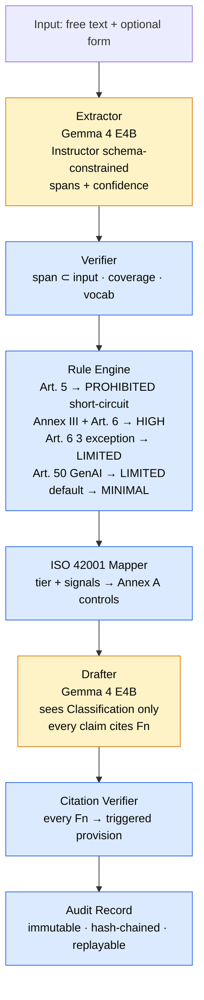

# AI Act Risk Assessor

Neuro-symbolic AI Act risk classification with deterministic audit trail.

A local, offline PoC that classifies AI features under the EU AI Act using
a compound AI system: LLM extraction (probabilistic) sandwiched by
deterministic rule engines and verifiers. Every assessment produces an
immutable, replayable, hash-chained audit record.

## Architecture



Yellow = probabilistic (LLM). Blue = deterministic. **LLMs never decide** — classification is 100% deterministic.

## Quick Start

```bash
# Install (requires Python 3.11+, uv recommended)
uv venv && uv pip install -e ".[dev]"

# Pull the required Ollama model (one model serves both extraction and drafting)
ollama pull gemma4:e4b

# Run an assessment (CLI)
assessor assess --input tests/fixtures/feature_employee_evaluation.txt

# Replay an audit record
assessor replay audit/2026-04-26/abc123.json

# List all assessments
assessor list

# Run without LLM (deterministic pipeline only)
assessor assess --input tests/fixtures/feature_employee_evaluation.txt --skip-llm
```

## Web UI (Streamlit)

A browser UI over the same pipeline — it runs no logic of its own; every
classification still flows through the deterministic rule engine and verifiers.
It makes the decision path visible: the full rule cascade (matched *and*
non-matched), extracted spans with confidence, ISO 42001 controls, the drafted
memo, and the hash-chained audit record. A second tab browses past audit records
and replays any of them.

```bash
uv pip install -e ".[ui]"
streamlit run streamlit_app.py
```

Toggle **Skip LLM** in the sidebar to exercise the deterministic path with no
Ollama instance running.

## Design Decision: Instructor over Outlines

**Instructor** was chosen for schema-constrained LLM extraction because:

1. It integrates natively with Ollama's OpenAI-compatible API
2. First-class Pydantic v2 support — the model IS the schema
3. JSON mode + validation retries enforce schema compliance at the API level
4. Simpler dependency chain than Outlines (which requires transformers backend)

For production, Outlines could be layered for token-level enforcement.
The Pydantic schemas stay identical either way.

## Rule Engine Cascade

Order is load-bearing:

| Priority | Check | Result | Short-circuits? |
|----------|-------|--------|-----------------|
| 1 | Article 5 prohibited signals | PROHIBITED | Yes |
| 2 | Annex III + Article 6 high-risk signals | HIGH | No |
| 3 | Article 6(3) exception (narrow conditions) | Downgrade HIGH → LIMITED | No |
| 4 | Article 50 GenAI transparency | LIMITED | No |
| 5 | Default | MINIMAL | — |

Every rule emits a `RuleEval` whether it matched or not, so the audit trail
records the entire decision path including non-matches.

## Controlled Vocabularies

- **ARTICLE_5_VOCAB**: 17 signals covering all prohibited practices (Art. 5(1)(a)-(h))
- **ANNEX_III_VOCAB**: 25 signals covering all 8 high-risk categories

The extractor is constrained to emit only tokens from these vocabularies.
The verifier rejects any out-of-vocabulary signals.

## Audit Trail

Each assessment produces:
- `<id>.json` — the complete AuditRecord (JSON Schema validated)
- `<id>.input.txt` — verbatim original input
- `<id>.memo.md` — the drafted assessment memo

Records are hash-chained: each record's `previous_record_sha256` links to the
prior record's canonical JSON hash. Canonicalization: sorted keys, no whitespace, UTF-8.

The replay verifier (`assessor replay`) re-runs all deterministic checks without
re-running LLMs, confirming the classification would be identical.

## Testing

```bash
pytest tests/ -v
```

137 tests covering:
- Every Article 5 signal → PROHIBITED (17 parametrized)
- Every Annex III signal → HIGH (25 parametrized)
- Article 6(3) exception logic (5 cases)
- Article 50 transparency triggers
- Minimal default
- Span verification, coverage, vocab validation
- Citation grounding
- Audit record assembly, hash chain, storage
- Replay verification with tamper detection

## How This Maps to ISO 42001

| Component | ISO 42001 Controls Satisfied |
|-----------|------------------------------|
| Rule Engine (`ai_act.py`) | A.5.2 (Risk Assessment), A.5.3 (Impact Assessment) |
| Audit Records (`audit.py`) | A.5.4 (Documentation), A.6.2.9 (AI System Documentation) |
| Verifiers (`verifier.py`) | A.6.2.4 (Verification & Validation) |
| Controlled Vocabularies (`schema.py`) | A.6.2.10 (Defined Use & Misuse) |
| ISO Mapper (`iso_42001.py`) | A.2.2 (AI Policy), A.2.3 (Responsible AI Topics) |
| Hash Chain + Replay (`replay.py`) | A.6.2.6 (Operation & Monitoring) |
| Human Review Escalation | A.9.5 (Human Oversight), A.8.5 (Enabling Human Actions) |
| Prompt Versioning + Hashing | A.6.2.3 (Training & Testing), A.10.3 (Shared ML Models) |
| CLI Transparency Output | A.8.2 (Informing About Interaction), A.8.3 (Informing About Outcomes) |

## Project Structure

```
src/assessor/
  schema.py          # Pydantic models, enums, controlled vocabularies
  ai_act.py          # Deterministic rule engine (Art. 5, Annex III, Art. 6(3), Art. 50)
  iso_42001.py       # ISO 42001 Annex A control mapping
  verifier.py        # Span checks, coverage, citation grounding
  normalizer.py      # Input hashing, text normalization
  extractor.py       # LLM extraction via Instructor + Ollama
  drafter.py         # LLM memo drafting via Ollama
  audit.py           # Audit record assembly, hash chain, storage
  audit_schema.py    # JSON Schema generation from Pydantic models
  replay.py          # Deterministic replay verifier
  cli.py             # CLI entry point
  prompts/
    extractor.jinja2 # Extraction prompt template (versioned, hashed)
    drafter.jinja2   # Drafting prompt template (versioned, hashed)
streamlit_app.py     # Web UI over the same pipeline (optional [ui] extra)
schemas/
  audit_record.schema.json  # Generated JSON Schema for audit records
tests/
  fixtures/          # 5 test fixtures (one per risk tier)
```

## Extension Points (Not Built in PoC)

- **Self-consistency extraction** (N>1 runs, majority vote) — marked in `extractor.py`
- **Cryptographic signing** of audit records — extend `AuditRecord`
- **Rule engine versioning** for replay across versions — noted in `replay.py`
- **German language support** — extend prompt templates
- **Platform integration** — wrap CLI as API service
